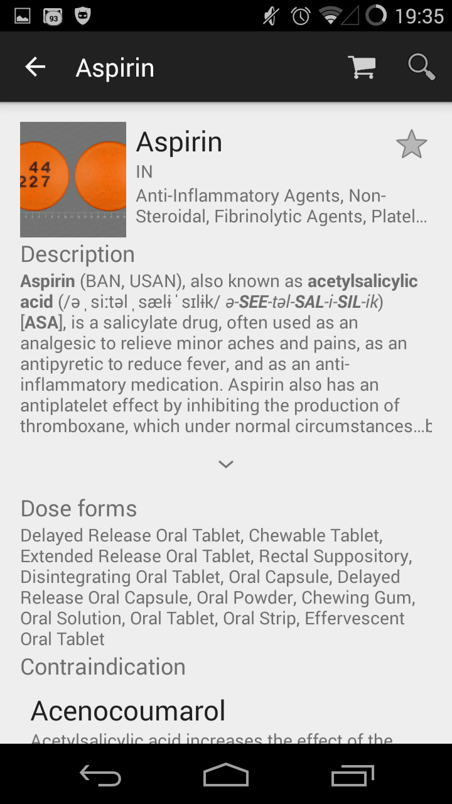
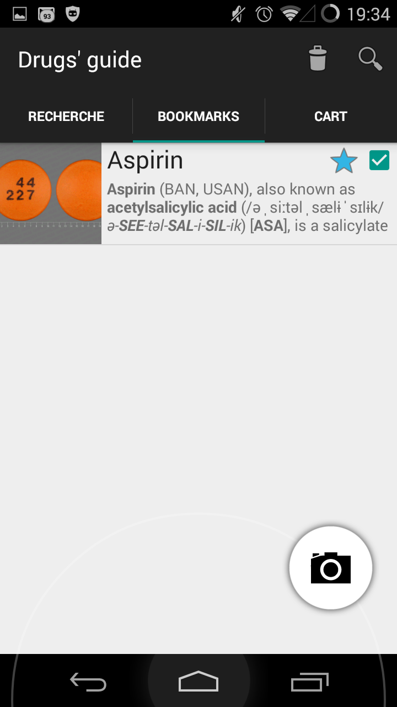
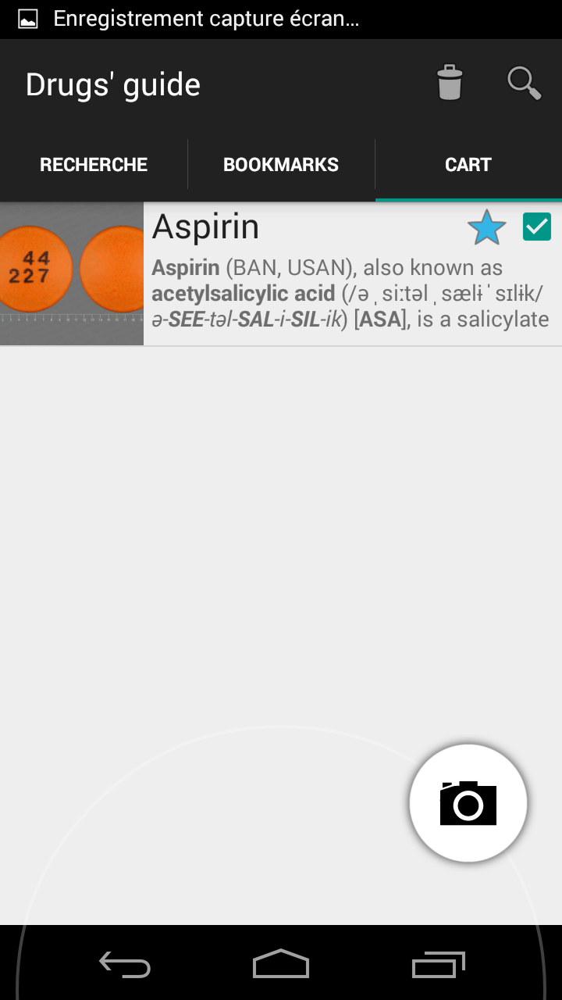
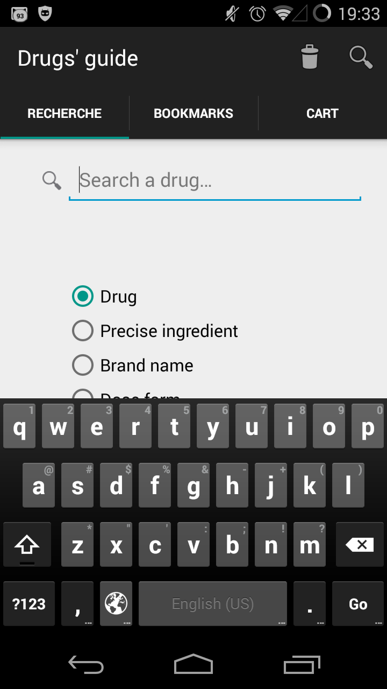

% Guide des médicaments -- Rapport final
% Aldo Lamarre; Patrice Dumontier-Houle; Charles Desharnais; Guillaume Poirier-Morency
% 30 avril 2012

Ceci est le rapport final du projet « Guide des médicaments ». Il couvre les
thèmes suivants:

 - usager cible
 - analyse des besoins
 - spécification technique
 - choix de conceptions
 - choix techniques
 - tests usagers et _feedback_
 - conclusion

Le code source du projet est entièrement disponible sur GitHub
[arteymix/guide-des-medicaments](https://github.com/arteymix/guide-des-medicaments).

L'application consomme les données fournis par l'API
[RxNav](http://rxnav.nlm.nih.gov) qui regroupe une grande quantité de données
pharmacologiques. Il est important d'avoir accès à Internet lorsque
l'application est utilisé afin d'éviter certains comportements indéfinis.


# Usager cible

Initialement, le projet ciblait le personnel de la santé (infirmières,
médecins, pharmaciens...) afin de servir de « Guide des médicaments » en
version électronique.

Nous avons donc consulté Santé Canada pour obtenir de l'information sur ce qui
était disponible au Canada en terme de service de données.

Suite à quelques complications (indisponibilité des données), les usagers
cibles sont devenus les gens normaux de la population, c'est-à-dire n'importe
quelle personne qui souhaite faire  usage d'un médicament en raison d'un
problème quelconque.  La plupart des usagers potentiels ont peu de
connaissances en informatique. Ils n'ont pas non-plus la mémoire nécessaire
pour se rappeler  de médicaments précédemment consultés lorsqu'ils naviguent;
un usager normal va probablement consulter les mêmes informations sur le même
médicament plus d'une fois. L'usager n'a pas non plus de connaissances sur les
médicaments potentiellement contrindiqués.


# Analyse des besoins

Le besoin principal des usagers est de pouvoir obtenir de l'information sur un
médicament à partir d'une information de départ pas nécessairement précise.

En fonction de l'analyse des usagers, des besoins plus spécifiques ont été
identifiés:

 - Offrir  plusieurs types de recherches (par nom, par ingrédient...) afin de
   maximiser les chances qu'un usager puisse retrouver le médicament souhaité.

 - Offrir un moyen de sauvegarde. Un usager n'a pas une mémoire à court terme
   lui permettant de se rappeler d'informations lues antérieurement sur un
   médicament. Il doit donc y avoir une liste de favoris, contenant les
   médicaments régulièrement consultés.

 - Offrir un panier, afin de permettre à l'usager de pouvoir se faire une liste
   temporaire de médicaments et voir les paires de médicaments contrindiqués.


# Spécification techniques

La spécification technique décrit en détails les cas d'utilisations possibles
de l'application:

 - rechercher un médicament
 - consulter un médicament
 - ajouter un médicament aux favoris
 - ajouter un médicament au panier
 - vider les favoris
 - vider le panier
 - consulter les favoris
 - consulter le panier


## Rechercher un médicament

La recherche de médicament doit pouvoir se faire par médicament, ingrédient
actif et marque.

Les résultats sont présentés dans une liste de médicaments, triés par
pertinence.


## Consulter un médicament

L'usager doit pouvoir consulter l'information propre à un médicament, soit

 - nom
 - description
 - contre-indications
 - médicaments similaires

La description du médicament est récupérée sur Wikipédia, car RxNav fournit de
l'information exclusivement terminologique.

RxNav fournit un API pour consulter les intéractions entre les médicaments, ce
qui ne correspond pas exactement à toutes les contre-indications qui sont
affichées dans l'application.




## Ajouter un médicament aux favoris

Une action doit permettre à l'usager d'ajouter ou d'enlever un médiacament des
favoris en cochant une étoile dans l'interface.

Deux vues permettent d'effectuer cette action:

 - le fragment `drug_fragment` qui présente un médicament
 - la vue `drug_item` qui affiche un médicament dans une liste


## Ajouter un médicament au panier

Une action au sein d'un médicament doit permettre à l'usager d'ajouter ce
médicament à son panier de médicaments.

Pour la vue `drug_item`, l'implémentation est exactement identique à celle des
favoris.

Pour le fragment, une action est présente dans le `ActionBar` permettant
d'ajouter et de se rendre directement au panier afin de constater les
changements. L'idée est que l'usager qui ajoute un médicament à son panier
depuis une action du menu voudra consulter le consulter par la suite.


## Consulter les favoris

L'application doit présenter la liste des médicaments que l'usager a marqué
comme favoris.

L'interface qui liste les médicaments d'un recherche est réutilisé pour
présenter les favoris. Il s'agit en fait d'un `ListFragment` dont l'utilisation
est décrite dans les choix techniques.




## Supprimer le contenu des favoris

Les médicaments marqués comme favoris doivent pouvoir être retirés en une seule
étape. L'usager doit être notifié et le contenu du panier doit être vidé.

L'application qui a été remise ne supporte pas encore l'actualisation du panier
après la suppression des médicaments qu'il contient. Il faudrait implanter la
fonctionnalité avec le `LoaderManager`.


## Consulter le panier

Le panier de médicaments doit pouvoir afficher la liste des médicaments qu'il
contient, les intéractions entre ces médiacments et chaque médicament
individuellement.




## Supprimer le contenu du panier

L'usager doit pouvoir supprimer l'entièreté du panier afin d'éviter qu'il aille
à enlever tous les médicaments un par un.

Similairement au panier, le contenu des favoris n'est pas mis à jour.


# Choix de conception

La navigation principale doit se faire en une seule activité. L'usager doit
pouvoir préserver ses résultats de recherche, l'état de ses favoris et de son
panier. De plus, cette navigation doit se faire aisément.

Nous avons donc choisis de faire une navigation par _tabs_, ce qui permet
à l'usager de naviguer efficacement en une seule étape à partir de l'activité
principale et de préserver la navigation au sein de l'activité principale. Ceci
constitue une métaphore de dossier organisés dans un classeur qu'un peut
facilement accéder à l'aide d'onglets.



Pour identifier facilement les actions possibles, l'application utilise une
l'iconographie.

 - loupe pour la recherche
 - étoile pour les favoris
 - panier pour ajouter un médicament au panier

L'application doit être facile à utiliser, alors nous avons mis beaucoup
d'effort à la concevoir avec un maximum d'intégration avec les pratiques de la
plate-forme Android. Nous avons, par exemple, intégré la recherche en _overlay_
afin de pouvoir lancer une recherche depuis n'importe quelle activité. Utiliser
les bonnes pratiques promues par la plateforme constitue une heuristique
d'utilisabilité très intéressante, car elle nous évite de réfléchir à ces
conceptions originales et facilite l'apprentissage de l'usager.

Une fonctionnalité que nous aurions aimé intégré est la corrections
automatiques. L'API nous offre des suggestions d'orthographes et la plateforme
nous permet de définir des _providers_ de suggestions.


# Choix techniques

L'application qui a été développé effectue beaucoup de requête HTTP. Elle sera
donc fortement soumise à de la latence et des problèmes de réseaux. Les choix
techniques qui sont décrit dans cette section cherchent à résoudre ces
problèmes.

Plusieurs librairies ont été utilisées afin de faciliter le développement du
projet.

 - Glide
 - Gson
 - OkHttp


## Glide

[Glide](https://github.com/bumptech/glide) permet d'intégrer des images de
manière efficace dans une application Android.

```java
Glide.with(this)
    .load(images.nlmRxImages[0].imageUrl)
    .into(drugIcon);
```

Elle est utilisé pour charger les images des comprimés associées aux
médicaments. RxNav offre un API pour récupérer des images
[RxImageAccess](http://rximage.nlm.nih.gov/).


## Gson

[Gson](https://github.com/google/gson) est une librairie qui permet d'utiliser
des objects JSON par des classes Java. Il suffit de déclarer une classe qui
représente l'objet fournit par l'API et Gson s'occupe d'en populer une
instance.

L'avantage principal est qu'il n'est plus nécessaire de parcourir la structure
à travers l'API traditionnel avec des `getJSONArray` et `getJSONObject`.


## OkHttp

OkHttp est un client HTTP efficace et résilient.

 - cache
 - compression gzip transparente
 - renvoit les requêtes échouée

L'application utilise une combinaison de fragments et d'activités. Toute la
navigation de l'activité principale se fait à l'aide de fragment.


## Fragments

Les fragments ont l'avantage d'être léger et réutilisable. Le fragment qui
présente un médicament, par exemple, est réutilisé dans l'activité qui présente
un médicament et dans le panier.

La plateforme offre aussi un fragment `ListFragment` pour présenter une liste
de vues équivalent au `ListView`. Il offre deux fonctionnalités intéressante
qui font en sorte qu'il constitue une excellent choix pour présenter des listes
de médicaments:

 - barre de progression lorsque l'adapteur est `null`
 - affiche un message lorsque l'adapteur est vide


## Persistence

Le stockage des préférences et du panier se fait par les préférences partagées.
Dans le cadre de notre application, nos besoins en persistence sont tellement
simple qu'il ne vaut pas la peine d'utiliser une base de donnée relationelle.

Il nous suffit de stocker un ensemble d'identifiants (rxcuis) pour pouvoir
mémoriser quels médicaments l'usager a ajouter à son panier ou à ses favoris.

Le stockage hors-ligne est partiellement fonctionnel est sert principalement
à réduire le nombre de requête HTTP qui sont effectuées auprès de l'API. Nous
utilisons de la cache HTTP pour stocker les réponses de l'API et offrir un
stockage transparent. C'est très avantageux, car l'application peut être
développé comme si on faisait des requêtes régulières tandis que les résultats
sont récupérés depuis le répertoire de cache du téléphone.


## Recherche

Les suggestions de recherche sont fournis à l'aide d'un `ContentProvider`. Il
s'agit d'une classe abstraite à partir de laquelle on doit implanter les
méthodes de recherches, d'insertion, de mise à jour et de suppression de
données depuis un _provider_.

Les `ContentProvider` sont enregistré dans le manifeste et peuvent par la suite
être utilisés par les activités installée sur le téléphone de l'usager.

Nous avons donc implanté un `ContentProvider` pour récupérer des suggestions de
recherche depuis l'API de RxNav. La plateforme s'occupe d'intégrer les
résultats automatiquement si les bonnes colonnes sont spécifiées dans le
curseur.


# Tests usagers & feedback

Trois tests usagers ont été effectués à différentes étapes du développement.
Ils ont permis d'identifier des problèmes d'utilisabilité assez rapidement et
nous ont guidés dans la conception.


## Test usager initial (prototype)

Les tests usagers préliminaires des prototypes ont identifiés quelques
problèmes:

 - l'activité principale devrait permettre de naviguer directement entre la
   recherche, les favoris et le panier
 - le checkbox du panier devrait être affiché directement sur le médicament,
   pas dans l'`ActionBar`
 -

La plupart des changements ont été intégré, d'où les différences entre les deux
prototypes mis en annexe.

Avoir l'action « ajouter au panier » directement dans l'`ActionBar` est
pratique, car on peut aller directement au panier après y avoir ajouté le
médicament affiché. Le checkbox a été rajouté à la vue `drug_item` qui présente
un médicament dans une liste.


## Deuxième test usager (pré-remise)

Patrice s'est occupé de faire un test usager avec le prototype qui a été
présenté en classe et a relevé les problèmes suivants:

 - Les médicaments contre-indiqués devraient être mis plus en avantage dans une
   description (mettre en gras rouge au pire)
 - La recherche par Brand name est totalement _useless_ (les noms des
   médicaments et les brand ne sont pas assez distingables)
 - Faciliter l'opération de recherche (ajouter un bouton "Search", l'icône de
   loupe n'interagit pas)
 - Le radio-button _precise ingredient_ devrait plutôt être _active ingredient_
   (le mot _precise_ fait peur)

La navigation par _spinner_ a été remplacé par des _tabs_ afin de réduire le
nombre de clics pour accéder aux fragments.


## Test usager final

Guillaume a effectué un test usager avec les modifications qui ont été
apportées et qui a mené à l'application remise.


# Perspectives d'avenir et rétrospective

Le projet a beaucoup de possibilité d'avenir si on décidait de continuer à le
développer.

Une version optimisée pour tablette pourrait servir en milieu de travail pour
des pharmaciens afin de consulter les format disponibles pour certains
médicaments.

 - inventaire par médicament
 - possibilité de construire un lot de médicament pour commander auprès d'un
   distributeur (panier sur stéroïdes)

Une intégration avec des services d'achat en ligne pourrait permettre de
référer des sites pour vendre des médicaments et potentiellement monétiser
l'application.

 - trouver les distributeurs qui fournissent le médicament

Une grande partie de la classification des médicament se fait par classes
(catégories), alors il serait vraiment bien de pouvoir permettre
à l'utilisateur de parcourir cette structure. Il serait alors possible de
pouvoirs effectuer des actions du genre:

 - trouver des analgésiques
 - trouver les médicaments dans la même classe du médicament consulté
 - améliorer les résultats de recherche en suggérant des classes en plus des
   médicaments

Le projet aurait beaucoup bénéficié d'une bonne connaissance des technologies
disponibles avant sa réalisation. Par exemple, si nous aurions su utilise Gson,
nous aurions pu développer les accès aux résultats de l'API en beaucoup moins
de temps et avec beaucoup plus de flexibilité.

Le projet s'est somme toute bien réalisé et nous sommes assez fier du résultat
final.

